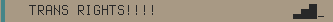

# SSID_SPAM

## About

Its a simple tool to spit out changing SSID's in the code given its got 13 propaganda like examples.
This tool also creates a captive portal of HTML which can be changed in the **Webpage.h** headerfile.

| Example



## How to Use

Almost all configuration is done in config.h

### Add SSID's

To add a new SSID add the following:

```cpp
const char ssid0[32] = "Example";
```

Make sure that the SSID is lower or equal to 32 characters.
If you add another SSID than the 13 current ones edit the `SSID_NUMBER` constant. (in main.cpp)

### Change Captive Portal

To change the webpage you need to edit the **webpage.h** header.
Make each new line of HTML its own quote from there just put HTML. Keep the webpage small because the ESP-12E's flash is 3MB.
